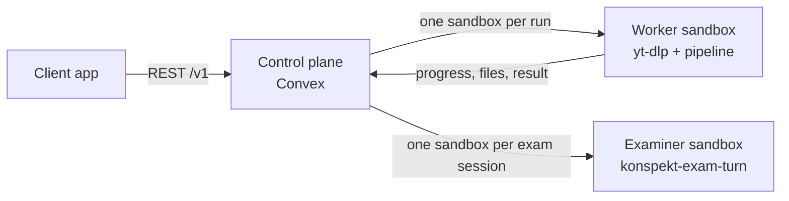

# crux-backend

Backend of Crux. It turns a recorded lecture into fact-checked study notes
(PDF and Markdown) with a self-check quiz, and runs an examiner chat that
keeps questioning a student until every quiz question is answered
correctly.

The repository holds two things that share one Python package, `konspekt`:

- **the pipeline**: a local CLI, `konspekt build lecture.mp4`, that does
  all the lecture processing;
- **the cloud service**: a REST API for a client application. Every
  lecture runs in its own Daytona sandbox, and a Convex deployment stores
  runs, results and exam sessions.

## What the pipeline does

- Transcribes speech with timestamps and speakers (ElevenLabs Scribe v2;
  local faster-whisper as an alternative adapter).
- Cuts off-topic digressions, anecdotes and admin talk, and keeps an
  auditable cut log with reasons.
- Fact-checks the lecturer's claims against web sources found through the
  Exa search API, in the lecture language and, for a non-English lecture,
  also in English.
  - A verdict may cite only sources the search returned for that claim.
  - Verdicts are confirmed, disputed, mixed or unverified. Disagreements
    carry a source link and a one-sentence rationale, and disputed claims
    carry a corrected wording.
  - The lecturer's words are never rewritten.
- Audits its own additions: every model-added fact or definition passes
  the same verification, and unsupported additions are dropped.
- Extracts deduplicated key frames (slides, whiteboard), crops them to the
  lecture content area and places them into the relevant sections.
- Adds missing illustrations from Wikimedia Commons, graded by a vision
  check. AI-generated images are off by default and are enabled with
  `--generated-images`.
- Turns structured material into tables, diagrams and charts next to the
  prose.
- Renders a Typst PDF with a table of contents, source timecodes, figure
  attribution, fact-check annotations and callouts. Cyrillic fonts are
  bundled.
- Resumes cheaply: every stage writes a fingerprinted JSON artifact and is
  skipped when its inputs are unchanged.

Stages, in order: ingest, transcription, visual, segmentation, factcheck,
notes, quiz, compose.

## Cloud service



- **Runs.** The client submits a YouTube URL.
  - The control plane queues the run and starts at most
    `MAX_PARALLEL_RUNS` runs at once (default 1); the others wait as
    `queued`.
  - The worker downloads the video through an outbound proxy, runs the
    pipeline and uploads the PDF, the Markdown bundle and the structured
    result.
  - Statuses: `queued`, `provisioning`, `running`, then `succeeded` or
    `failed`.
  - Only public YouTube videos of up to 4 hours are accepted.
- **Exam sessions.** An examiner questions a student on the quiz of a
  succeeded run.
  - A wrong answer gets an explanation from the notes, with the section
    and video timestamp. The question then comes back later in new
    wording; a failed choice question comes back as an open one.
  - The session ends only when every question is mastered, or when the
    client closes it.
  - Replies are synchronous, typically 5-15 s. Grading is done by
    deterministic code from the model's structured assessment, so a
    student cannot talk the examiner into a pass.
- **API.** The full contract is [`control-plane/openapi.yaml`](control-plane/openapi.yaml).
  Every request carries `Authorization: Bearer <SERVICE_API_KEY>`.

| Method | Path | Purpose |
|---|---|---|
| POST | `/v1/runs` | submit a YouTube URL |
| GET | `/v1/runs/{run_id}` | run status and completed stages |
| GET | `/v1/runs/{run_id}/result` | outline, sections, claims, quiz, cut log, file URLs |
| POST | `/v1/runs/{run_id}/exams` | open an exam session; returns the first question |
| GET | `/v1/exams/{exam_id}` | exam status and per-question progress |
| GET | `/v1/exams/{exam_id}/messages` | message history |
| POST | `/v1/exams/{exam_id}/messages` | send a student message; returns the examiner's reply |
| POST | `/v1/exams/{exam_id}/close` | close an exam session |

The service stores no users. The client maps runs and exam sessions to
its own users.

## Repository layout

| Path | Contents |
|---|---|
| `src/konspekt/features/` | vertical slices of the pipeline and the examiner (`exam`) |
| `src/konspekt/pipeline/` | CLI, MCP server and the pipeline composition root |
| `src/konspekt/worker/` | the cloud worker that runs inside a run sandbox |
| `control-plane/` | Convex control plane, its tests and the OpenAPI description |
| `deploy/` | Daytona snapshot builders, smoke tests and end-to-end scripts |
| `spec/` | the specification, one file per partition |
| `tests/` | Python tests |

## Running the pipeline locally

Requirements:

- Python >= 3.12 and [uv](https://docs.astral.sh/uv/);
- `ffmpeg` and `ffprobe` on PATH;
- the Claude Code CLI, logged in (`claude /login`);
- `ELEVENLABS_API_KEY` and `EXA_API_KEY`;
- optional: `tesseract` with `rus` and `eng` data, for the slide OCR signal;
- optional: the `codex` CLI, for generated illustrations.

```sh
uv sync
brew install ffmpeg tesseract tesseract-lang
echo 'ELEVENLABS_API_KEY=...' > .env
echo 'EXA_API_KEY=...' >> .env
uv run konspekt build lecture.mp4 -o out/
```

A missing prerequisite fails fast with exit 2 and an actionable message.

The output goes to `out/<lecture-slug>/`:

- `konspekt.pdf`;
- `quiz.json`: questions with rubrics and timestamps;
- `konspekt.md`: the whole lecture in one agent-readable Markdown file;
- `md/`: the same content split per section;
- stage artifacts in `work/`.

Useful flags:

- `--lang auto|ru|en`;
- `--force-from <stage>`;
- `--max-llm-usd <n>`, the spend budget per run (default 15);
- `--generated-images`.

For local transcription instead of the cloud one, run `uv sync --extra local-whisper`.

Coding agents can drive the pipeline through the project skill
`.claude/skills/konspekt/SKILL.md` or through the MCP server:

```sh
claude mcp add konspekt -- uv run --directory <repo> konspekt-mcp
```

## Deploying the cloud service

1. **Control plane.**

   ```sh
   cd control-plane
   npm ci
   CONVEX_DEPLOY_KEY=... npx convex dev --once
   ```

   Environment of the Convex deployment. Set each variable with
   `npx convex env set NAME`, which reads the value from stdin.

   | Variable | Purpose |
   |---|---|
   | `SERVICE_API_KEY` | bearer key of the client API |
   | `WORKER_API_BASE` | the deployment's HTTP base URL, used by the worker to call back |
   | `DAYTONA_API_KEY` | creates and deletes sandboxes |
   | `WORKER_SNAPSHOT`, `EXAMINER_SNAPSHOT` | Daytona snapshot names |
   | `PROXY_URL` | outbound proxy for YouTube downloads |
   | `CLAUDE_CODE_OAUTH_TOKEN` | Claude Code in the sandboxes, from `claude setup-token` |
   | `ELEVENLABS_API_KEY`, `EXA_API_KEY` | pipeline providers |
   | `MAX_PARALLEL_RUNS` | concurrent runs, default 1 |

2. **Snapshots.** Build the worker and examiner snapshots with the scripts
   in `deploy/daytona/`; see [its README](deploy/daytona/README.md).
   Rebuild a snapshot whenever the code it bakes changes.
3. **Check.** `deploy/e2e_run.py` submits a run and waits for its result.
   `deploy/e2e_exam.py` drives an exam session on a succeeded run until it
   is mastered.

## Development

The specification under `spec/` is the source of truth. Code changes
follow spec changes and pass the `sdd lint` and `sdd ready` gates of
[agent-sdd](https://github.com/cyberash-dev/agent-sdd). Conventions,
commands and pitfalls for contributors and coding agents are in
[`AGENTS.md`](AGENTS.md).

```sh
uv run pytest -q
cd control-plane && npm test && npm run typecheck
```
